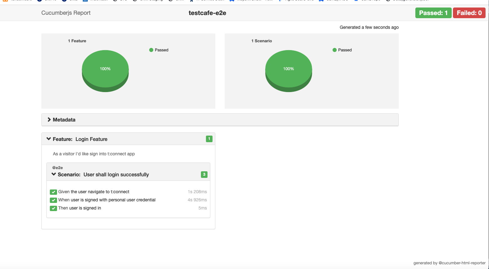

# Testcafe-sample

## Description
This is sample project created to run E2E test using TestCafe. (BDD is supplied through Cucumber framework)

## Installation:
- Run `npm install` (tested node version is v14.17.3)

## How to execute tests
- Run `npm run test`

## How to generate report:
- Run `npm run report` 
- It will generate report as below:

## How to:
- Change Browser: Update setBrowser method to change browser name under "features/support/world.js"
    - this could be refactored
- Concurrency: update the concurrency field in `.testcaferc.json` file to support parallel execution

